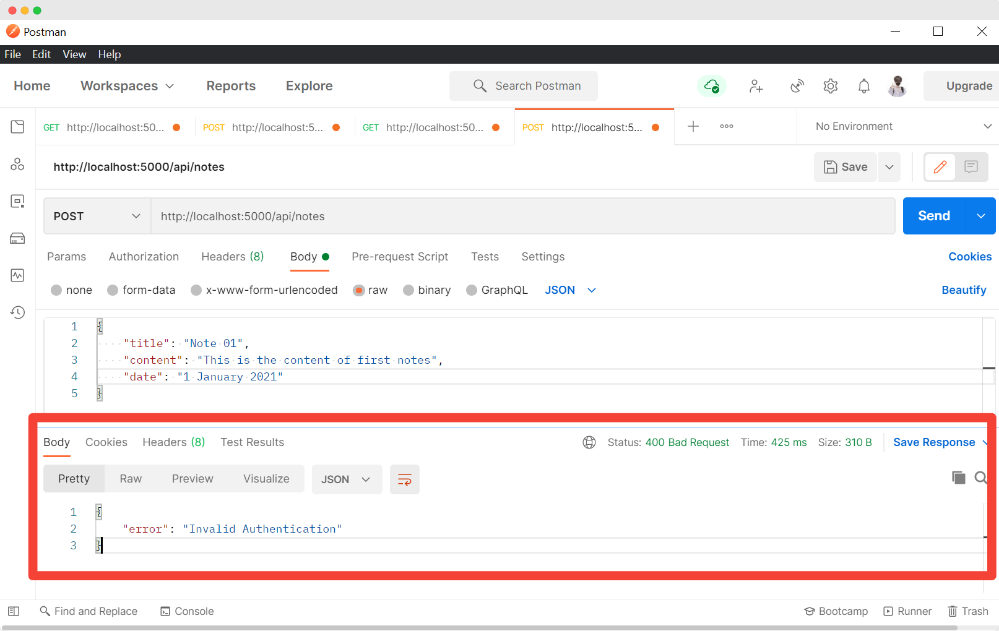

# THE **MERN** STACK — TESTING ROUTES

In this chapter, we are going to test every route and check it's working. We are going to use [Postman](https://www.postman.com/) for testing the application.

## Postman

It is an interactive application that would simplify the API testing process. Create an account in [postman](https://www.postman.com/) and open a workspace. You can easily send the request in a few simple steps. Make sure your application is running.

Let's send the first request to our application's root URL.

1) Select the type of HTTP request you want to send.
2) Enter the URL in the box.
3) Hit **Send** button, you can see the response in the `response` window.

You can send the data in POST request in the `body` tab.

## `/register`

Let's register a user. We should send the required data in the `body` tab of the request. You must get the success message as the response. Otherwise, it will send an error message.

You can also find that the user gets created in our database like this:

Let's try sending another request with the same email. This should return a response saying the email already exists.

We can say that our `/users/register` route is working properly as expected.

## `/login`

Let's try to log in. This should send the `token` and success message.

Try logging in with a wrong password. It should return an error message.

Try logging in with an email that does not exist in your database. This should return the error message saying the `User does not exist`.

## `/verify`

Let's verify the token. You should add the token to the header `Authorization` of the request.

In the headers tab, add the `Authorization`  key with any value. You should get `false` if the token is not correct.

Copy the token you get after logging in and try to add that token as an `Authorization` value. You should get `true`.

## `/api/notes`

## Creating notes

Try to create notes by sending a POST request to `/api/notes`. Firstly you should see the error `Invalid Authentication`, meaning there is no token sent along with the request. This is the way to allow only logged-in users can use our application.

If you send an invalid token, it returns the same error.

Now try to add the correct token just like we did before and send the request. You should get the success message.

You can also find that the notes have been added to the database under `notes` collections.

## Reading notes

Send a GET request to the same endpoint with a valid token in the header. You should get all the notes you added in the response.

Copy the `_id` of the notes. Try to get the single notes using this id.

## Update notes

Use the `id` and create a PUT request with new content in the request body. You should get the success message saying `Notes updated`.

You should also find the notes updated in the database.

## Delete notes

You can send the DELETE request to the route using the specific id of the notes you want to delete. You should get the success message and notes will be deleted from the database.

If everything works fine, let's continue working on the front-end of our project. If any error occurs, try to troubleshoot the error using the message you get in the response. With this, I believe your backend will be perfect and can respond correctly to all HTTP requests.